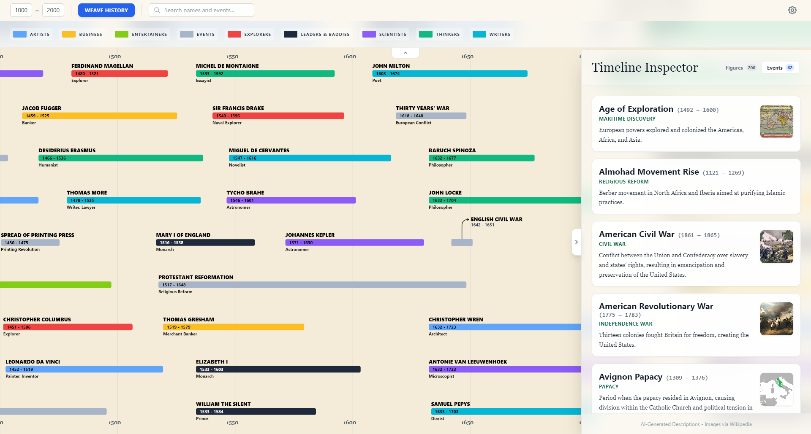
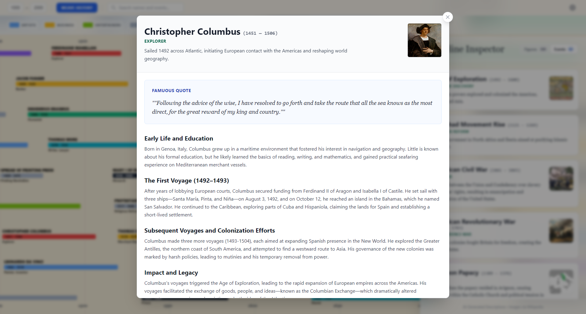
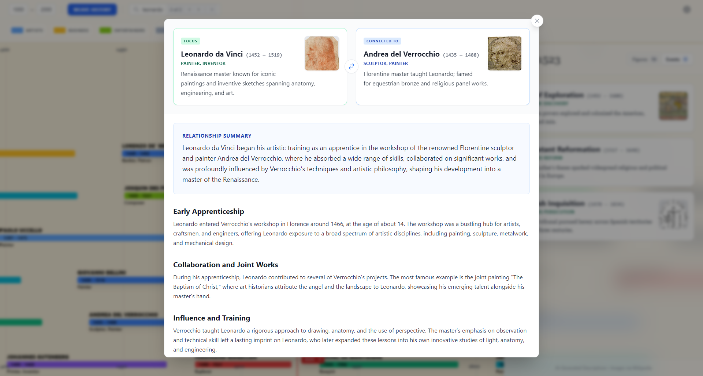

# ChronoWeave

An interactive historical timeline visualization platform powered by AI. Explore centuries of history through an intuitive canvas-based interface, discovering relationships between historical figures and events, and diving deep into the stories that shaped civilization.

<div align="center">
   
</div>

## About ChronoWeave

ChronoWeave transforms the study of history into an immersive, visual experience. Rather than reading linear timelines, you can:
- **Visualize** historical figures and events across centuries in an interactive 2D canvas
- **Explore** relationships and connections between people who shaped history
- **Discover** new figures and events through contextual expansion
- **Learn** detailed biographies, famous quotes, and historical context powered by AI

The app leverages Google Gemini or OpenRouter APIs to intelligently generate historical data and analyze connections between figures, making history discovery feel like an interactive journey through time.

<div align="center">
   
   
</div>

## Key Features

### 🎨 Interactive Timeline Canvas
- Visualize historical figures and events as bars on a horizontal timeline
- Zoom and pan the canvas for detailed exploration
- Color-coded by category (Artists, Scientists, Leaders, Writers, etc.)
- Click on years to see all figures active during that period
- Hover over figures to reveal action options

### 🔗 Relationship Mapping
- **Map Relationships**: Click "Map Relationships" to visualize connections between a figure and related historical figures
- **Visual Connection Lines**: Relationship bars show AI-identified connections, with visual lines connecting related figures
- **Detailed Explanations**: Click on a relationship to read an AI-generated explanation of how two figures were connected
- **Smart Analysis**: AI identifies relationships based on contemporary periods, influence, and historical significance

### 🔍 Contextual Discovery
- **Expand Timeline**: Click "Expand Timeline" on any figure to discover new related historical figures not in the current view
- **Intelligent Addition**: Newly discovered figures are seamlessly added to the timeline with preserved visual layout
- **Visual Highlighting**: Newly discovered figures are visually distinguished from existing ones
- **Automatic Relationships**: New figures are automatically connected to the source figure with relationship visualization

### 📖 Deep Dive Biographies
- **Read Biography**: Click to view detailed AI-generated biographical information
- **Famous Quotes**: Discover iconic quotes from historical figures
- **Sectioned Content**: Information organized into meaningful categories (achievements, legacy, historical context, etc.)
- **Wikipedia Integration**: Enriched with images and descriptions from Wikipedia
- **Lazy Loading**: Details are fetched on-demand, keeping the app fast

### 🏷️ Category Filtering & Legend
- **8 Figure Categories**: Artists, Business, Entertainers, Explorers, Leaders & Baddies, Scientists, Thinkers, Writers
- **Historical Events**: Separate category for major historical events (wars, treaties, movements)
- **Visual Legend**: Toggle categories on/off to focus on specific disciplines
- **Color Coding**: Each category has a distinct color for easy identification
- **Bulk Filtering**: Reset all filters or select multiple categories at once

### 🔎 Figure Search & Navigation
- **Real-time Search**: Type figure names to instantly highlight matching results
- **Search Navigation**: Navigate through search results with next/previous buttons
- **Result Counter**: See how many figures match your search
- **Search Focus**: Automatically highlights and focuses on search results

### ⚙️ Flexible AI Backend
- **Provider Selection**: Switch between Google Gemini and OpenRouter API
- **OpenRouter Support**: Use any OpenRouter-compatible model (Claude, Llama, etc.)
- **Easy Configuration**: Settings dialog to manage API keys and model selection
- **Persistent Settings**: Your provider and model preferences are saved locally

### 📱 Responsive Interface
- **Collapsible Sidebar**: Shows figures active in selected year or global figure list
- **Figure Details Panel**: View full descriptions, images, and occupation details
- **Toast Notifications**: Real-time feedback on discoveries, searches, and actions
- **Progress Overlays**: Clear loading states during data fetching and analysis

### 🌍 Figure & Event Management
- **Custom Year Ranges**: Build timelines for any historical period
- **Alphabetically Sorted Lists**: Sidebar figures and events sorted alphabetically by name
- **Preserved Scroll Position**: Separate scroll tracking for figures and events—switch between tabs and your scroll position is remembered
- **Dual View Mode**: Toggle between figures and events in the sidebar
- **Category-aware Filtering**: Sidebar respects active category filters

## Installation & Setup

**Prerequisites:** Node.js

1. Install dependencies:
   ```bash
   npm install
   ```

2. Set the `PROVIDER`, `API_KEY`, and optionally `MODEL` in environment files to configure the AI backend:

**For Development:**
Create or edit [.env.local](.env.local):
```bash
PROVIDER=gemini
API_KEY=your_api_key_here
# Optional: specify model
# If omitted, defaults to: gemini-2.5-flash (Gemini) or openai/gpt-oss-120b (OpenRouter)
MODEL=gemini-2.5-flash
```

**For Production:**
Create [.env.production](.env.production) with your production credentials:
```bash
PROVIDER=gemini
API_KEY=your_production_api_key_here
# Optional: MODEL will default based on PROVIDER if not specified
MODEL=gemini-2.5-flash
```

**Important Notes:**
- `.env.local` is used for **local development** (`npm run dev`) and is gitignored by default.
- `.env.production` is used when building for **production** (`npm run build`).
- In production mode, the settings dialog is **hidden**, and the application strictly uses environment variables from the build, ignoring any localStorage overrides.
- Both `.env.local` and `.env.production` should be added to `.gitignore` to prevent committing secrets.

More explanations in the [.env.example](.env.example)

3. Run the development server:
   ```bash
   npm run dev
   ```

The app will be available at `http://localhost:3000`

### Settings Configuration

ChronoWeave offers flexible configuration through both environment variables and the in-app Settings dialog.

#### How Settings Work

**Development Mode (npm run dev):**
- Settings can be configured via `.env.local` file OR the in-app Settings dialog
- **Priority**: localStorage (from Settings dialog) > `.env.local` environment variables
- The Settings dialog allows real-time configuration changes without restarting the dev server
- Settings are saved to browser localStorage with keys: `chrono_provider`, `chrono_api_key`, `chrono_model`

**Production Mode (npm run build):**
- The Settings dialog is **hidden** in production
- Configuration is **strictly** from `.env.production` environment variables
- localStorage settings are ignored for security

#### Using the Settings Dialog (Development Only)

1. Click the settings gear icon in the control panel
2. Configure the following:
   - **AI Provider**: Choose between "Google Gemini" or "OpenRouter"
   - **API Key**: Enter your API key for the selected provider
     - [Get Gemini API key](https://aistudio.google.com/apikey)
     - [Get OpenRouter API key](https://openrouter.ai/keys)
   - **Model ID**: Specify the model to use (auto-fills with defaults when switching providers)
     - Gemini default: `gemini-2.5-flash`
     - OpenRouter default: `openai/gpt-oss-120b`
3. **Test** your connection before saving (validates API key and model)
4. Click **Save & Reload** to apply changes (reloads timeline data with new configuration)

**Validation**: All fields are required. The Test and Save buttons are disabled until all fields are filled.

**Connection Testing**: The Test button validates your API credentials and model without saving changes. Success/error messages appear as toast notifications.

**Current Configuration Display**: The dialog shows which provider and model are currently active (from environment or localStorage).

#### Configuration Examples

**Using Gemini (with default model):**
```bash
PROVIDER=gemini
API_KEY=your_gemini_api_key
# MODEL is optional - defaults to gemini-2.5-flash
```

**Using Gemini (with custom model):**
```bash
PROVIDER=gemini
API_KEY=your_gemini_api_key
MODEL=gemini-2.5-flash
```

**Using OpenRouter (with default model):**
```bash
PROVIDER=openrouter
API_KEY=your_openrouter_api_key
# MODEL is optional - defaults to openai/gpt-oss-120b
```

**Using OpenRouter with Claude:**
```bash
PROVIDER=openrouter
API_KEY=your_openrouter_api_key
MODEL=anthropic/claude-3.5-sonnet
```

**Using OpenRouter with Llama:**
```bash
PROVIDER=openrouter
API_KEY=your_openrouter_api_key
MODEL=meta-llama/llama-3.3-70b-instruct
```

## Available Commands

```bash
# Development server with hot reload
npm run dev

# Build for production
npm run build

# Preview production build locally
npm run preview
```

## Technology Stack

- **Frontend**: React 19 with TypeScript
- **Bundler**: Vite 6
- **AI APIs**: Google Gemini & OpenRouter
- **Styling**: Tailwind CSS
- **Canvas Rendering**: HTML5 Canvas with custom layout algorithm
