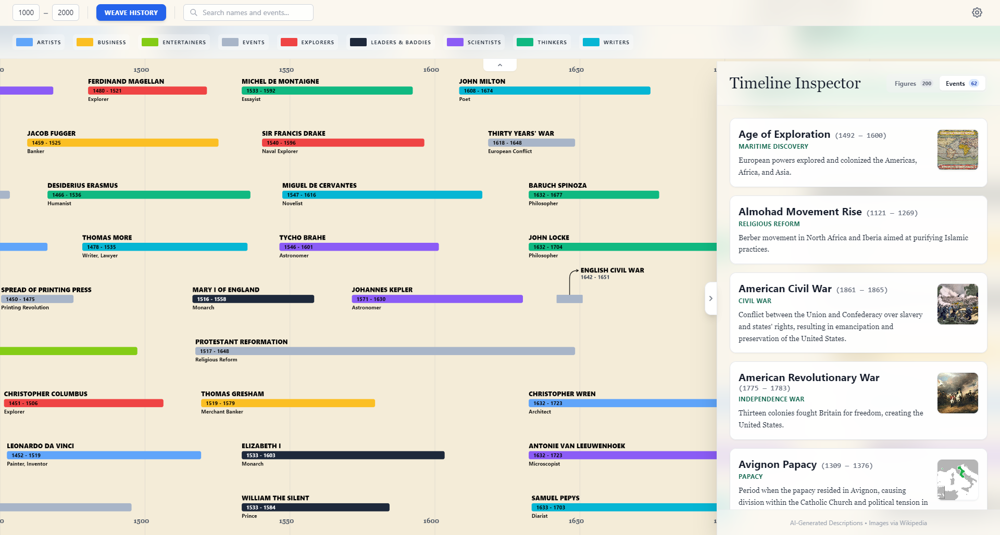
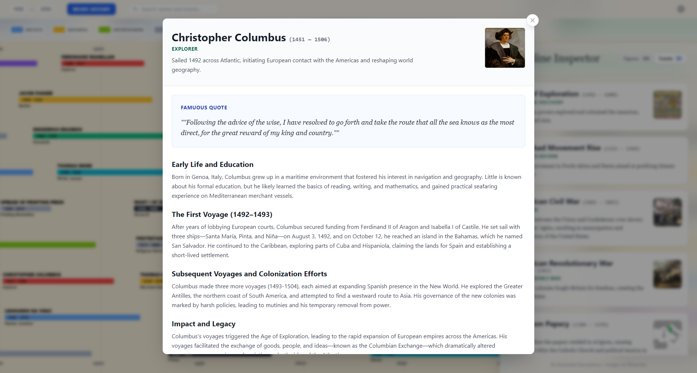
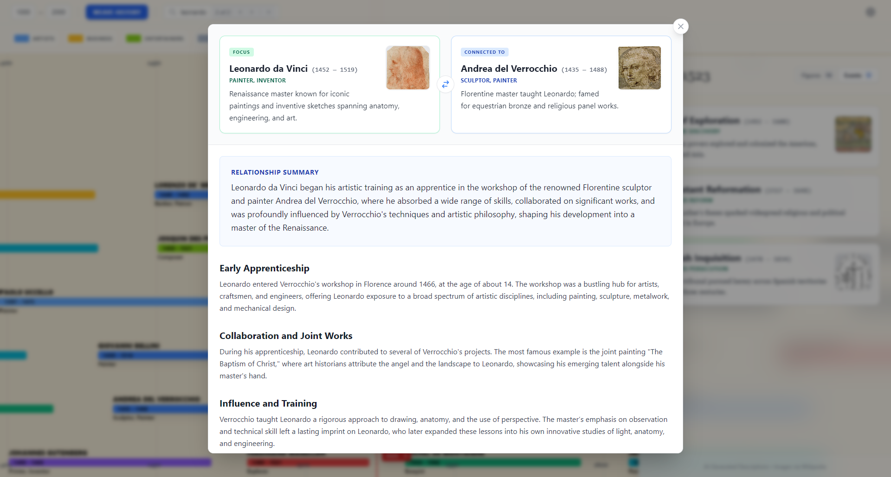

# ChronoWeave

An interactive historical timeline visualization platform powered by AI. Explore centuries of history through an intuitive canvas-based interface, discovering relationships between historical figures and events, and diving deep into the stories that shaped civilization.

<div align="center">
   
</div>

## About ChronoWeave

ChronoWeave transforms the study of history into an immersive, visual experience. Rather than reading linear timelines, you can:
- **Visualize** historical figures and events across centuries in an interactive 2D canvas
- **Explore** relationships and connections between people who shaped history
- **Discover** new figures and events through contextual expansion
- **Learn** detailed biographies, famous quotes, and historical context powered by AI

The app uses Google Gemini, OpenRouter, or Ollama to generate historical data and analyze connections between figures, making history discovery feel like an interactive journey through time.

<div align="center">
   
   
</div>

## Key Features

### 🎨 Interactive Timeline Canvas
- Visualize historical figures and events as bars on a horizontal timeline
- Zoom and pan the canvas for detailed exploration
- Color-coded by category (Artists, Scientists, Leaders, Writers, etc.)
- Ctrl+click (Command+click on macOS) to select a year; Alt+click to clear it
- Click a figure to open its actions; press Escape or click away to dismiss them

### 🔗 Relationship Mapping
- **Map Relationships**: Click "Map Relationships" to visualize connections between a figure and related historical figures
- **Visual Connection Lines**: Relationship bars show AI-identified connections, with visual lines connecting related figures
- **Detailed Explanations**: Click on a relationship to read an AI-generated explanation of how two figures were connected
- **Smart Analysis**: AI identifies relationships based on contemporary periods, influence, and historical significance

### 🔍 Contextual Discovery
- **Expand Timeline**: Click "Expand Timeline" on any figure to discover new related historical figures not in the current view
- **Intelligent Addition**: Newly discovered figures are seamlessly added to the timeline with preserved visual layout
- **Visual Highlighting**: Newly discovered figures are visually distinguished from existing ones
- **Automatic Relationships**: New figures are automatically connected to the source figure with relationship visualization

### 📖 Deep Dive Biographies
- **Read Biography**: Click to view detailed AI-generated biographical information
- **Famous Quotes**: Discover iconic quotes from historical figures
- **Sectioned Content**: Information organized into meaningful categories (achievements, legacy, historical context, etc.)
- **Wikipedia Integration**: Enriched with images and descriptions from Wikipedia
- **Lazy Loading**: Details are fetched on-demand, keeping the app fast

### 🏷️ Category Filtering & Legend
- **8 Figure Categories**: Artists, Business, Entertainers, Explorers, Leaders & Baddies, Scientists, Thinkers, Writers
- **Historical Events**: Separate category for major historical events (wars, treaties, movements)
- **Visual Legend**: Toggle categories on/off to focus on specific disciplines
- **Color Coding**: Each category has a distinct color for easy identification
- **Bulk Filtering**: Reset all filters or select multiple categories at once

### 🔎 Figure Search & Navigation
- **Real-time Search**: Type figure names to instantly highlight matching results
- **Search Navigation**: Navigate through search results with next/previous buttons
- **Result Counter**: See how many figures match your search
- **Search Focus**: Automatically highlights and focuses on search results

### ⚙️ Flexible AI Backend
- **Provider Selection**: Switch between Google Gemini, OpenRouter, and Ollama
- **OpenRouter Support**: Use any OpenRouter-compatible model (Claude, Llama, etc.)
- **Ollama Support**: Connect to a local Ollama server or directly to Ollama Cloud
- **Easy Configuration**: Settings dialog to manage API keys and model selection
- **Persistent Settings**: Your provider and model preferences are saved locally

### 📱 Responsive Interface
- **Collapsible Sidebar**: Shows figures active in selected year or global figure list
- **Figure Details Panel**: View full descriptions, images, and occupation details
- **Toast Notifications**: Real-time feedback on discoveries, searches, and actions
- **Progress Overlays**: Clear loading states during data fetching and analysis

### 🌍 Figure & Event Management
- **Custom Year Ranges**: Build timelines for any historical period
- **Alphabetically Sorted Lists**: Sidebar figures and events sorted alphabetically by name
- **Preserved Scroll Position**: Separate scroll tracking for figures and events—switch between tabs and your scroll position is remembered
- **Dual View Mode**: Toggle between figures and events in the sidebar
- **Category-aware Filtering**: Sidebar respects active category filters

## Installation & Setup

**Prerequisites:** Node.js

1. Install dependencies:
   ```bash
   npm install
   ```

2. Set the `PROVIDER`, `API_KEY`, and optionally `MODEL` in environment files to configure the AI backend:

**For Development:**
Create or edit [.env.local](.env.local):
```bash
PROVIDER=gemini
API_KEY=your_api_key_here
# Optional: specify model
# If omitted, defaults to: gemini-2.5-flash (Gemini) or openai/gpt-oss-120b (OpenRouter)
MODEL=gemini-2.5-flash
```

**For Production:**
Create [.env.production](.env.production) with your production credentials:
```bash
PROVIDER=gemini
API_KEY=your_production_api_key_here
# Optional: MODEL will default based on PROVIDER if not specified
MODEL=gemini-2.5-flash
```

**Important Notes:**
- `.env.local` is used for **local development** (`npm run dev`) and is gitignored by default.
- `.env.production` is used when building for **production** (`npm run build`).
- Both development and production modes support runtime configuration via the Settings dialog (saved to localStorage).
- Environment variables serve as fallback defaults when localStorage settings are not configured.
- Both `.env.local` and `.env.production` should be added to `.gitignore` to prevent committing secrets.

More explanations in the [.env.example](.env.example)

3. Run the development server:
   ```bash
   npm run dev
   ```

The app will be available at `http://localhost:3000`

### Settings Configuration

ChronoWeave offers flexible configuration through both environment variables and the in-app Settings dialog.

#### How Settings Work

Both development and production modes work identically:

- Settings can be configured via environment files (`.env.local` or `.env.production`) OR the in-app Settings dialog
- **Priority**: localStorage (from Settings dialog) > environment variables
- The Settings dialog allows real-time configuration changes without restarting or rebuilding
- The active provider is saved as `chrono_provider`; settings are stored separately in `chrono_settings_gemini`, `chrono_settings_openrouter`, `chrono_settings_ollama_local`, and `chrono_settings_ollama_cloud`. Existing shared settings are migrated automatically.
- Ollama Cloud keys entered in the dialog persist in the browser's provider profile when you click **Save**, like Gemini and OpenRouter keys. Server-side `OLLAMA_API_KEY` remains outside the frontend bundle.
- Ollama reasoning defaults to off. **Enable reasoning** in Settings or set `OLLAMA_REASONING=true` for supported models. GPT-OSS uses low effort when off and medium when enabled. Local and cloud modes remember this setting separately.
- Environment variables serve as fallback defaults when localStorage is not configured
- This provides maximum flexibility for both development and production deployments

#### Using the Settings Dialog

1. Click the settings gear icon in the control panel
2. Configure the following:
   - **AI Provider**: Choose "Google Gemini", "OpenRouter", or "Ollama"
   - **API Key**: Enter your API key for the selected provider
     - [Get Gemini API key](https://aistudio.google.com/apikey)
     - [Get OpenRouter API key](https://openrouter.ai/keys)
   - **Model ID**: Specify the model to use (auto-fills with defaults when switching providers)
     - Gemini default: `gemini-2.5-flash`
     - OpenRouter default: `openai/gpt-oss-120b`
3. **Test** your connection before saving (validates API key and model)
4. Click **Save** to apply changes. The displayed timeline stays in place; new AI requests use the selected provider/model. Click **Build** to regenerate it, including the same year range.

**Validation**: Gemini and OpenRouter require an API key and model. Local Ollama requires a valid server URL and model. Ollama Cloud requires a model and either a saved dialog key or a server-side environment key.

**Connection Testing**: The Test button validates your API credentials and model without saving changes. Success/error messages appear as toast notifications.

**Current Configuration Display**: The dialog shows which provider and model are currently active (from environment or localStorage).

### AI prompt configuration

Shared prompt wording lives in [`src/services/prompts.ts`](src/services/prompts.ts). Counts, word limits, chunking rules, event duration, and deep-dive sections live in [`src/constants.ts`](src/constants.ts). See the [AI prompt guide](docs/ai-prompts.md) for selection rules, generation targets, provider JSON handling, and cache behavior.

### Ollama setup

See the [Ollama setup guide](docs/ollama.md) for step-by-step Linux/WSL instructions, local and cloud model examples, model switching, and troubleshooting. The direct-cloud relay starts inside `npm run dev` or `npm run preview`; there is no separate relay server to launch.

Use Ollama on the same computer as ChronoWeave. The Settings dialog offers **Local server** and **Ollama Cloud** modes, model suggestions from the selected server/catalog, a **Refresh models** button, and manual model entry. Settings remembers each mode's model separately. Models must support chat and follow JSON instructions; embedding-only models cannot supply timeline data. The app does not download models automatically.

For your local Ollama installation, set these values in `.env.local` (development) or `.env.production` (local production build/preview):

```dotenv
PROVIDER=ollama
OLLAMA_MODE=local
MODEL=gpt-oss:20b-cloud
OLLAMA_BASE_URL=http://localhost:11434
```

Start Ollama. To use cloud models through the local server, sign in using `ollama signin` and make the chosen cloud model available in Ollama. No API key is required in ChronoWeave's local mode. Downloaded local models work through the same mode. If browser requests fail, check the URL and configure `OLLAMA_ORIGINS` to allow the exact app origin (for example, `http://localhost:3000`), then restart Ollama. See [Ollama authentication](https://docs.ollama.com/api/authentication) and [origin configuration](https://docs.ollama.com/faq#how-can-i-allow-additional-web-origins-to-access-ollama).

For direct cloud access:

```dotenv
PROVIDER=ollama
OLLAMA_MODE=cloud
MODEL=gpt-oss:20b
OLLAMA_API_KEY=your_ollama_cloud_api_key
```

Create an [Ollama API key](https://ollama.com/settings/keys), or enter it in Settings and click **Save** to retain it across reloads. Leave the dialog key blank to use `OLLAMA_API_KEY` from the server environment. This variable stays server-side; use `OLLAMA_API_KEY`, not the Gemini/OpenRouter `API_KEY` variable. The relay only forwards to `https://ollama.com/api` and accepts requests from the local app. Cloud model IDs must match the [cloud catalog](https://docs.ollama.com/cloud), rather than assuming a local `-cloud` alias is valid.

Run `npm run dev`, or `npm run build` followed by `npm run preview` for a locally served production build. The cloud relay is available in both Vite servers. A deployment containing only the static `dist` files has no cloud relay; direct cloud access requires a server. Restart the server after changing environment values; rebuild production assets after changing provider/model defaults. Keep environment files out of source control.

Page load restores a cached timeline, or leaves an empty timeline for you to build explicitly with **Weave History**. A 600–1600 build uses 21 generation requests before retries: 10 century batches of people, 10 century batches of events, and one batch of major events across the entire range. Ollama requests run sequentially to avoid bursts. GPT-OSS requests use `think: "low"` to reduce reasoning overhead; other models retain their defaults. Each request has a three-minute timeout; a complete timeline may take longer. Invalid output receives one corrective retry; transient rate-limit/busy errors receive at most two retries. A failed build preserves the displayed timeline and its cache. [Ollama Cloud currently lacks enforced structured outputs](https://docs.ollama.com/capabilities/structured-outputs), so responses are requested as JSON and validated in the app.

For Linux/WSL server commands, downloading and switching models, and cloud examples, follow the [Ollama setup guide](docs/ollama.md).

Relationship maps, biographies, and relationship explanations are cached in browser localStorage and reused across providers/models. Remapping the same figure on the same canvas restores its connections after closing the overlay or reloading. Known relationship pairs and explanations can also be reused from either figure. Changing timeline figures requires a new search for remaining candidates; unchanged known pairs stay available even if that search fails. An empty map automatically tries **Expand Timeline** once for that source and canvas. If no connections are found, the overlay keeps the focus card visible and shows a message; explicit **Expand Timeline** can retry. Switching models affects uncached requests and explicit timeline builds.

Events lasting less than three years are omitted from new and cached timelines. Short events are filtered without failing the build or changing their historical dates.

AI content in relationship and biography dialogs renders Markdown, including emphasis, lists, links, quotations, tables, and code. Existing cached responses receive the same formatting without regeneration.

Relationship explanations use a conversational historical style: a short summary followed by several paragraphs about the pair's circumstances, shared actions or influence, and consequences. The shared prompt targets 2–4 sections and 250–450 words where the facts support that depth. Relevance checks stay factual and separate from the reader-facing prose. Older positive relationship explanations refresh on their next use; timelines, relationship maps, biographies, and cached rejections remain intact.

Figure, event, and discovery descriptions, plus biographies and event analyses, use the same warm, clear voice for curious readers. Their existing word limits and section structures remain in place. Descriptions focus on what people did and why it mattered, using supported details rather than generic praise or invented scenes.

To run the focused configuration, service, and relay tests, install [Bun](https://bun.sh) and run `bun test`. Run `npm run typecheck` and `npm run build` for TypeScript and production checks.

For an opt-in live check of all Ollama service methods, run `bun run scripts/verify-ollama.ts gpt-oss:20b-cloud`. This sends generation requests and consumes the selected model's quota. For direct cloud mode, configure `OLLAMA_MODE=cloud`, an optional `OLLAMA_API_KEY`, and `CHRONOWEAVE_URL` if the relay is served somewhere other than `http://localhost:3000`; pass a cloud catalog model ID as the argument.

#### Configuration Examples

**Using Gemini (with default model):**
```bash
PROVIDER=gemini
API_KEY=your_gemini_api_key
# MODEL is optional - defaults to gemini-2.5-flash
```

**Using Gemini (with custom model):**
```bash
PROVIDER=gemini
API_KEY=your_gemini_api_key
MODEL=gemini-2.5-flash
```

**Using OpenRouter (with default model):**
```bash
PROVIDER=openrouter
API_KEY=your_openrouter_api_key
# MODEL is optional - defaults to openai/gpt-oss-120b
```

**Using OpenRouter with Claude:**
```bash
PROVIDER=openrouter
API_KEY=your_openrouter_api_key
MODEL=anthropic/claude-3.5-sonnet
```

**Using OpenRouter with Llama:**
```bash
PROVIDER=openrouter
API_KEY=your_openrouter_api_key
MODEL=meta-llama/llama-3.3-70b-instruct
```

## Available Commands

```bash
# Development server with hot reload
npm run dev

# Build for production
npm run build

# Preview production build locally
npm run preview
```

## Technology Stack

- **Frontend**: React 19 with TypeScript
- **Bundler**: Vite 6
- **AI APIs**: Google Gemini, OpenRouter, and Ollama
- **Styling**: Tailwind CSS
- **Canvas Rendering**: HTML5 Canvas with custom layout algorithm
