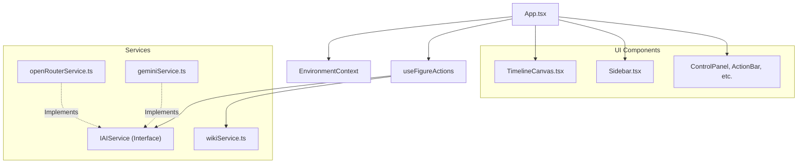
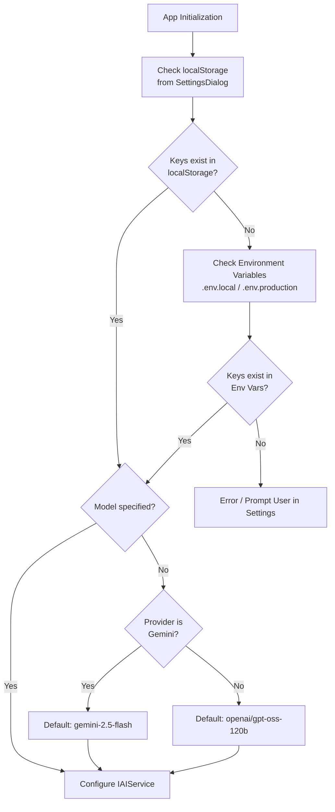
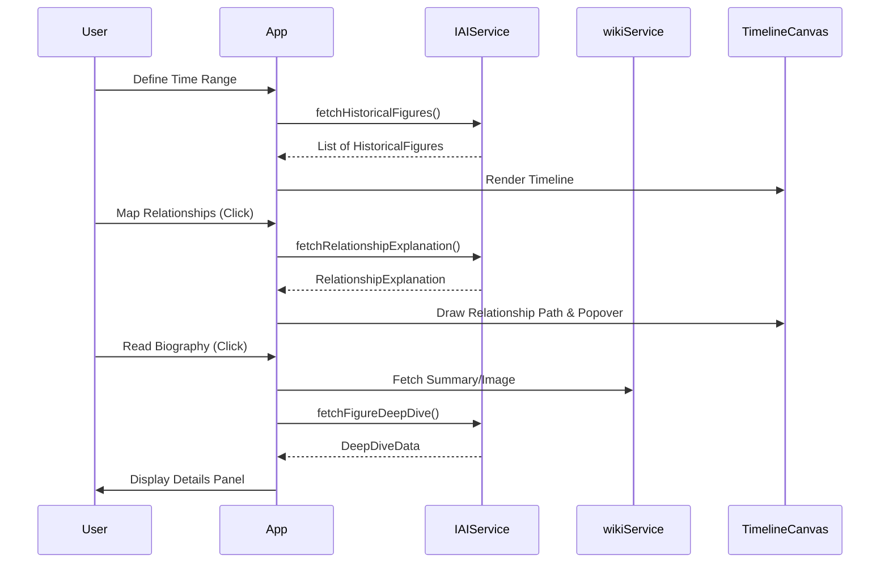

# ChronoWeave Architecture Overview

ChronoWeave is an interactive historical timeline visualization platform powered by AI. It allows users to explore centuries of history through an intuitive canvas-based interface, discovering relationships between historical figures and events.

## Tech Stack

- **Frontend Framework**: React 19 with TypeScript
- **Build Tool**: Vite 6
- **Styling**: Tailwind CSS
- **Graphics/Visualization**: HTML5 `<canvas>` with a custom layout and rendering algorithm
- **AI Integration**: Google Gemini and OpenRouter APIs
- **External Data**: Wikipedia API

## Core Architecture & Components

The application follows a standard React frontend architecture with a strong separation of concerns between UI components, custom hooks for logic, and external service integrations.

### 1. Main Application & UI Components
Located in `src/components/`, the UI is composed of several interactive elements:
- **`TimelineCanvas.tsx`**: The core visualization engine. It uses HTML5 Canvas to render the timeline, handling zoom, pan, and drawing the `HistoricalFigure` objects and their relationship links.
- **`Sidebar.tsx`**: A collapsible panel displaying lists of figures active in a selected year or globally.
- **`ControlPanel.tsx` & `FloatingToolbar.tsx` & `ActionBar.tsx`**: Toolbars and controls that allow the user to interact with the timeline, search for figures, and manage filters.
- **`Legend.tsx`**: Manages and displays category filters (Artists, Scientists, Leaders, etc.).
- **`RelationshipPopover.tsx`**: Displays detailed AI-generated explanations of relationships between historical figures.
- **`SettingsDialog.tsx`**: Allows users to configure their preferred AI provider (Gemini or OpenRouter) and API keys, saving preferences to local storage.

### 2. Services Layer
Located in `src/services/`, this layer handles all external API communications.
- **`geminiService.ts`**: Integrates with the Google Gemini API.
- **`openRouterService.ts`**: Integrates with OpenRouter to support alternative LLMs (e.g., Claude, Llama).
- Both implement the `IAIService` interface (defined in `src/types.ts`) which standardizes operations like `fetchHistoricalFigures`, `fetchRelatedFigures`, `discoverRelatedFigures`, `fetchRelationshipExplanation`, and `fetchFigureDeepDive`.
- **`wikiService.ts`**: Connects to the Wikipedia API to retrieve rich biographical information, summaries, and images for the historical figures.

### 3. State Management & Hooks
- **`App.tsx`**: Likely serves as the main orchestrator, holding significant global state for the timeline configuration, loaded figures, and active selection.
- **`src/contexts/EnvironmentContext.tsx`**: Manages configuration state (API keys, provider choice).
- **`src/hooks/useFigureActions.tsx`**: Encapsulates the business logic for user interactions on specific historical figures (e.g., mapping relationships, deep diving into biographies).

### 4. Data Models
Defined in `src/types.ts`, the core domain models include:
- `HistoricalFigure`: Represents a person or event, including birth/death years, occupation, and category.
- `FigureCategory`: Categorization enum (e.g., 'ARTISTS', 'SCIENTISTS', 'EVENTS').
- `TimelineConfig` & `ViewState`: Manage the current visible span and canvas transformations (scale, translate).
- `LayoutData` & `TimelineItemProps`: Used by the canvas renderer to calculate positions.
- `DeepDiveData` & `RelationshipExplanation`: Structured data formats returned by the AI services.

## Configuration & API Key Management

The application features a flexible configuration system that prioritizes user settings while providing solid defaults.

## Data Flow

1. **Initialization**: The app initializes and checks `EnvironmentContext` for API credentials (from `.env` or `localStorage`).
2. **Fetch & Render**: The user defines a time range, and the app calls the configured `IAIService` to fetch a list of `HistoricalFigure`s. These are plotted on the `TimelineCanvas`.
3. **Exploration**: 
   - **Deep Dive**: When a user clicks to view more details, `wikiService` fetches Wikipedia summaries and images, while the `IAIService` fetches AI-generated deep dives.
   - **Discover & Map**: User actions trigger `discoverRelatedFigures` or `fetchRelationshipExplanation`, dynamically adding new figures to the state and instructing the canvas to draw relationship paths.
4. **Interactive Canvas**: The canvas constantly repaints based on changes to `ViewState` (panning/zooming) or when new figures/relationships are added to the global state.
