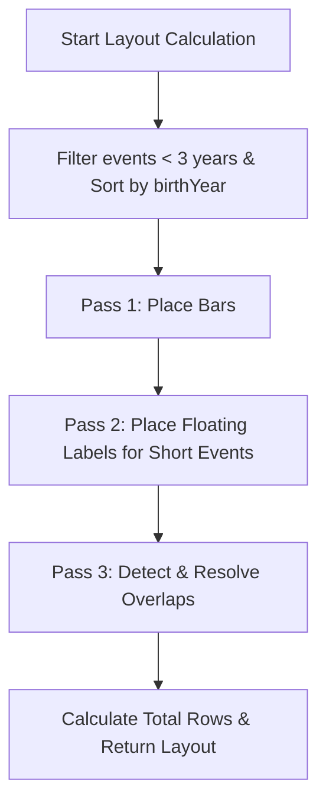
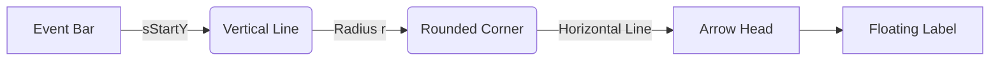

# Timeline Canvas Placement Algorithm

## Overview
This document describes how historical figures and events are placed on the `TimelineCanvas` in the ChronoWeave application. 

Historical figures and events are processed **together in a unified multi-pass layout algorithm**.

---

## Canvas Layout Structure

Historical figures and events are placed on horizontal **Rows**. To prevent **Short Events** (spanning less than 15 years) from taking up too much horizontal space due to their long text labels, only their short duration bar is placed on the Row. Their text label is instead floated into the **Gaps** between the rows.

```text
      Index                Layout Structure
      
      Row 0            ================================== [Historical Figures & Event Bars]
      Gap 0.5          ---------------------------------- [Floating Labels for Short Events]
      Row 1            ================================== [Historical Figures & Event Bars]
      Gap 1.5          ---------------------------------- [Floating Labels for Short Events]
      Row 2            ================================== [Historical Figures & Event Bars]
```

---

## 1. The Multi-Pass Layout Algorithm

The layout runs inside a React `useMemo` hook and consists of three distinct passes. 
Before the passes begin, extremely short events (< 3 years) are filtered out, and the remaining items are sorted by `birthYear`. Priority figures (e.g., from search/discovery) are grouped first, followed by standard figures.

### Pseudocode Flowchart



### Pass 1: Place Bars
In this pass, every item (both figures and events) finds the first available horizontal row where it doesn't collide with existing items.
- For **Figures & Long Events**: The occupied width includes both the duration of the bar and the length of the text.
- For **Short Events**: The occupied width is *only* the duration of the bar itself (the text is ignored for now).

```javascript
// Pseudocode for Pass 1
for each item in sortedItems:
    width = calculateOccupiedWidth(item, false)
    collisionEnd = item.birthYear + width + MARGIN
    
    placedRow = findFirstAvailableRow(item.birthYear, collisionEnd)
    addIntervalToRow(placedRow, item.birthYear, collisionEnd)
```

### Pass 2: Place Floating Labels (Short Events Only)
For short events, we now need to place their text labels in the "gaps" (e.g., gap 0.5 is between row 0 and row 1).

```javascript
// Pseudocode for Pass 2
for each shortEvent in items:
    labelWidth = calculateOccupiedWidth(shortEvent, true)
    
    // Try Gap Above
    if tryPlaceLabelInGap(gapAbove):
        recordLabelPlacement()
    // Try Gap Below
    else if tryPlaceLabelInGap(gapBelow):
        recordLabelPlacement()
    // Relocate Bar
    else:
        moveBarToNextAvailableRow()
        repeat Gap Placement...
```

**Emergency Fallback:** To prevent infinite loops in highly crowded timeline segments, there is a limit of 10 relocation attempts (`MAX_RELOCATION_ATTEMPTS`). If the bar is relocated 10 times and still cannot find an open gap for its floating label, the algorithm triggers an emergency fallback: it forces a brand new row at the absolute bottom of the canvas and places the item there.

### Pass 3: Post-Placement Overlap Resolution
Sometimes placing floating labels creates new overlaps between labels in the same gap. By default, floating labels prioritize placement in the gap **above** the bar first, and if occupied, try the gap **below**. Pass 3 detects any remaining overlaps and attempts to resolve them by moving the overlapping labels to the opposite gap.

---

## 2. Collision Detection Algorithm

The collision detection is based on **1D Interval Overlap**. Each row (and each gap) maintains a list of occupied intervals `{start, end}`.

1. **Calculate Width:** Uses `calculateTextWidth` to estimate text width in pixels based on character count, font size, and uppercase/bold weightings, then converts it to "timeline years" (`BASE_PIXELS_PER_YEAR`).
2. **Interval Check:** An item overlaps if `(newStart < existingEnd + MARGIN)` AND `(newEnd + MARGIN > existingStart)`. Here, `MARGIN` is a visual buffer (currently set to 6 years) added around each element to ensure they do not touch each other.
3. **Connector Crossing Check:** When placing floating labels, the algorithm also checks if the vertical connector line from the bar to the label would intersect with any previously drawn connector lines.

---

## 3. Manhattan Routes

For Short Events, the bar is on a main row, and the label is in a gap above or below. To visually link them, the canvas draws a **Manhattan Route** (also known as orthogonal or elbow routing). 

A Manhattan Route consists of horizontal and vertical line segments with right-angle turns (resembling the grid-like streets of Manhattan). In ChronoWeave, these sharp corners are smoothed out using quadratic bezier curves (`Q` in SVG paths) with a fixed border radius of `15px`.

### Visual Representation of Manhattan Routing

```text
       Gap Below Placement                            Gap Above Placement

       [ EVENT BAR ]                                  +-------------> [ FLOATING LABEL TEXT ]
             |                                        |
             | <--- Vertical segment                  | <--- Vertical segment
             |                                        |
             +-------------------> [ LABEL ]    [ EVENT BAR ]
      (Radius curve)    Horizontal segment
```

### Routing Logic (from the codebase)
The SVG path is constructed dynamically by projecting world coordinates (years, rows) to screen coordinates:

1. **Start Point (`sStartX`, `sStartY`):** The top or bottom center of the short event's bar.
2. **End Point (`sEndX`, `sEndY`):** The left edge of the floating label container.
3. **Path Generation:**
   - Draw line straight down/up.
   - Draw a rounded corner (`Q` curve) based on the direction (`signX`, `signY`).
   - Draw horizontal line to the target.
   - Attach a 45-degree chevron (arrowhead) at the end.



This ensures that even in crowded areas of the timeline, short events cleanly point to their descriptions without diagonally cutting across other elements.

---

## 4. Technical Nuances & Edge Cases

1. **Heuristic Text Measurement (No DOM Access)**
   Because the entire layout is calculated inside a React `useMemo` hook *before* anything is actually rendered to the DOM, the algorithm cannot use standard methods like `getBoundingClientRect()` to measure how wide a text label will be. Instead, it relies on empirically derived character multipliers (e.g., `0.82` for uppercase, `0.78` for bold) to estimate the pixel width of strings, and then divides by `BASE_PIXELS_PER_YEAR` to convert that into timeline space.

2. **Priority Hierarchy (Top-Row Claiming)**
   Before Pass 1 begins, the algorithm separates "Priority Figures" (those that are part of an active search or recently discovered) from "Standard Figures". Priority figures are processed first. This guarantees that the most important elements claim the lowest row indexes (the top of the screen), keeping the user's focus grounded where it matters most.

3. **Spatial Stability During Filtering**
   When a user toggles category filters (e.g., hiding "Events"), the layout algorithm is intentionally **not** recalculated. Instead of the timeline collapsing and shifting remaining items around (which would be disorienting), unfiltered items are visually muted using CSS (`opacity-10 grayscale`). This ensures the timeline's coordinate space remains stable and predictable.

4. **Dynamic Canvas Bounds (Gap-Aware Height)**
   The total height of the canvas isn't simply the number of rows multiplied by the row height. The algorithm computes an `effectiveTotalRows = Math.max(maxRowIndex, maxGapIndex + 0.5)`. Because short events can push their floating labels into a gap *below* the last populated row, failing to account for gaps would result in the bottom-most labels being visually cut off by the canvas boundary.

5. **Strict Z-Index Layering Structure**
   To make the placement algorithm look correct when elements densely overlap, the canvas relies on a strict DOM layering hierarchy:
   - **Layer 1:** Grid Lines (Years) and red ghost selection lines.
   - **Layer 1.5:** Selection Rectangles (the white background glow for focused items).
   - **Layer 2:** Main Content (Historical Figure Bars and Floating Gap Labels).
   - **Layer 2.5:** Manhattan Routes (SVG lines drawn *behind* the main content so they don't block text).
   - **Layers 3-5:** Overlays, Floating Source Cards, and the Discovery Action Bar.
